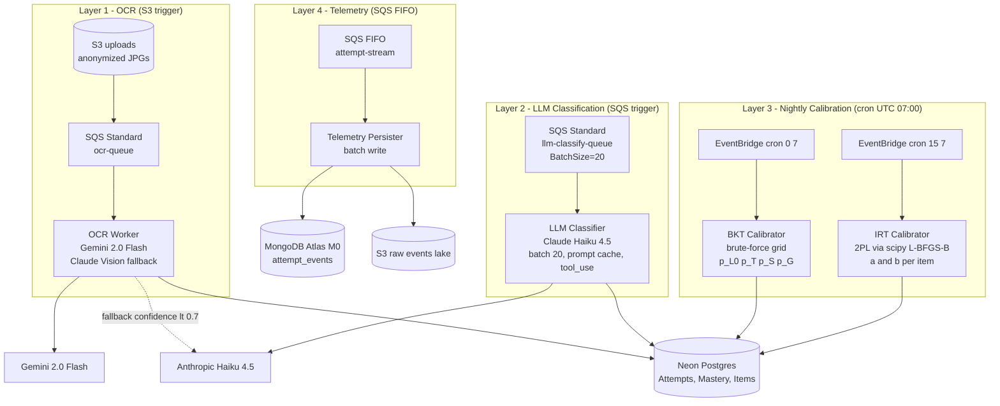

# innova-ai-engine

> Motor de Knowledge Tracing y Clasificación de Errores para la plataforma **Innova EdTech**.
>
> Python 3.11 · uv · Pydantic v2 · Anthropic Claude Haiku 4.5 · Gemini 2.0 Flash · scipy · numpy · asyncpg · structlog
>
> **Sin PyTorch. Sin Scikit-Learn. Sin Modal.com en MVP.**

---

## Tabla de contenidos

- [innova-ai-engine](#innova-ai-engine)
  - [Tabla de contenidos](#tabla-de-contenidos)
  - [1. Visión general](#1-visión-general)
  - [2. Arquitectura del pipeline](#2-arquitectura-del-pipeline)
  - [3. Stack tecnológico](#3-stack-tecnológico)
  - [4. Fundamento teórico](#4-fundamento-teórico)
    - [Bayesian Knowledge Tracing (BKT)](#bayesian-knowledge-tracing-bkt)
    - [Notas de implementación en Python](#notas-de-implementación-en-python)
    - [Item Response Theory — 2PL (IRT)](#item-response-theory--2pl-irt)
    - [LLM Classifier](#llm-classifier)
    - [OCR Vision](#ocr-vision)
  - [5. Estructura del repositorio](#5-estructura-del-repositorio)
  - [6. Metodología y flujo de trabajo](#6-metodología-y-flujo-de-trabajo)
    - [6.1 GSD / BMAD](#61-gsd--bmad)
    - [6.2 AI usage logs](#62-ai-usage-logs)
    - [6.3 Gitflow](#63-gitflow)
    - [6.4 Reglas de código obligatorias](#64-reglas-de-código-obligatorias)
  - [7. Variables de entorno](#7-variables-de-entorno)
  - [8. Setup local](#8-setup-local)
    - [Prerrequisitos](#prerrequisitos)
    - [Pasos](#pasos)
    - [Ejecutar un handler localmente](#ejecutar-un-handler-localmente)
    - [Comandos frecuentes](#comandos-frecuentes)
  - [9. Tests y cobertura](#9-tests-y-cobertura)
    - [Suites clave](#suites-clave)
  - [10. Despliegue (AWS Lambda container images)](#10-despliegue-aws-lambda-container-images)
    - [Prerrequisitos AWS](#prerrequisitos-aws)
    - [Build y deploy de una imagen](#build-y-deploy-de-una-imagen)
    - [Build todas las imágenes](#build-todas-las-imágenes)
    - [CI/CD (GitHub Actions)](#cicd-github-actions)
  - [11. Cost engineering](#11-cost-engineering)
  - [12. Privacidad y cumplimiento NNA](#12-privacidad-y-cumplimiento-nna)
  - [13. Roadmap](#13-roadmap)
  - [14. Recursos](#14-recursos)
  - [15. Licencia](#15-licencia)

---

## 1. Visión general

Este repositorio aloja todos los **workers de ML/IA** del ecosistema Innova. Cada worker es un **AWS Lambda container image** independientemente deployable:

| Worker | Trigger | Función |
|--------|---------|---------|
| `ocr_worker` | S3 event (upload JPG) | Extrae pasos matemáticos de foto escaneada — Gemini primary, Claude fallback |
| `llm_consumer` | SQS Standard (batch 20) | Clasifica errores `UNCLASSIFIED` con Claude Haiku 4.5 + prompt caching |
| `nightly_bkt` | EventBridge cron 07:00 UTC | Calibra parámetros BKT por skill (grid search) |
| `nightly_irt` | EventBridge cron 07:15 UTC | Calibra parámetros IRT 2PL por item (scipy L-BFGS-B) |
| `telemetry_persister` | SQS FIFO (attempt-stream) | Persiste eventos raw a MongoDB + S3 |

---

## 2. Arquitectura del pipeline



> Guía Draw.io formal (UML con lollipop/socket interfaces, NFR notes): `docs/drawio/03-how-to-draw-knowledge-tracing-pipeline.md`

---

## 3. Stack tecnológico

| Capa | Tecnología | Versión | Razón |
|------|-----------|---------|-------|
| Lenguaje | Python | 3.11 | `match` statements, `from __future__ import annotations` |
| Package manager | uv | 0.4+ | Ultrafast, lockfile reproducible, reemplaza pip/venv |
| Type checker | pyright | strict | Zero warnings en CI — único gatekeeper de tipos |
| Linter/Formatter | ruff | 0.4+ | Reemplaza flake8+black+isort en un binario |
| Schemas | Pydantic v2 | 2.x | Validación en runtime, `model_config`, no `dict[str, Any]` |
| ML compute | numpy + scipy | latest | BKT grid search, IRT L-BFGS-B — sin GPU |
| LLM SDK | anthropic | ≥0.40 | `cache_control` ephemeral, `tool_use` forzado |
| Vision SDK | google-generativeai | ≥0.8 | Gemini 2.0 Flash (pendiente migración a `google-genai` SDK en TODO-AI-1) |
| DB async | asyncpg | latest | Pool async para Lambda handlers |
| Logging | structlog | latest | JSON, `trace_id` propagation, sin `print()` |
| Tests | pytest + hypothesis + moto | ≥7, ≥6 | Property-based BKT/IRT, moto para SQS/S3 |
| Deploy | AWS Lambda container | — | Imagen Docker por handler, ECR |
| Infra | AWS CDK / Serverless | — | EventBridge crons, SQS event sources |

**Explícitamente excluido:** scikit-learn, torch, tensorflow, Modal.com (ADR-002).

---

## 4. Fundamento teórico

### Bayesian Knowledge Tracing (BKT)

Corbett & Anderson (1995). Modelo de 4 parámetros por (alumno, skill):

1. **Probabilidad de conocimiento dado un acierto ($obs = 1$):**
$$P(L_n | obs=1) = \frac{(1 - p_{slip}) \cdot P(L_{n-1})}{(1 - p_{slip}) \cdot P(L_{n-1}) + p_{guess} \cdot (1 - P(L_{n-1}))}$$

1. **Probabilidad de conocimiento dado un error ($obs = 0$):**
   $$P(L_n | obs=0) = \frac{P(L_{n-1}) \cdot p_{slip}}{P(L_{n-1}) \cdot p_{slip} + (1 - P(L_{n-1})) \cdot (1 - p_{guess})}$$

1. **Transición de aprendizaje (Learning Transition):**
$$P(L_n) = P(L_{n-1} | obs) + (1 - P(L_{n-1} | obs)) \cdot p_{transit}$$

---

### Notas de implementación en Python

Para mantener la consistencia con el **Pipeline BKT + IRT**

- **$P(L_n)$**: Representa el *mastery* o dominio actual del estudiante
- **$p_{slip}$**: Probabilidad de cometer un error conociendo la regla
- **$p_{guess}$**: Probabilidad de acertar por azar sin conocer la regla
- **$p_{transit}$**: Probabilidad de aprender el procedimiento tras una oportunidad de práctica

Esta lógica es la que permite que el **Dashboard del Profesor** identifique si un error es un "descuido" (slip) o una falta real de conocimiento antes de la prueba

Defaults iniciales (Corbett & Anderson 1995): `p_L0=0.3, p_T=0.1, p_S=0.1, p_G=0.2`.

Calibración nocturna: grid search exhaustivo sobre `[0.05, 0.95]` step `0.05` → ~130K combinaciones por skill (skip si `p_slip + p_guess ≥ 1.0`). Minimiza negative log-likelihood agrupando intentos por estudiante. Escribe parámetros de vuelta a `Postgres.skill_bkt_params`.

> **Nota de identifiabilidad:** `p_L0` y `p_transit` son confundidos en datos de secuencia única (Corbett & Anderson 1995). Los parámetros medibles (`p_slip`, `p_guess`) son los que el grid search recupera con mayor confiabilidad.

### Item Response Theory — 2PL (IRT)

Lord (1980). Probabilidad de respuesta correcta:

```
P(correct | theta) = 1 / (1 + exp(-a * (theta - b)))
```

$$P(correct | \theta) = \frac{1}{1 + e^{-a(\theta - b)}}$$

- `a` — discriminación (diferencia alumnos que saben de los que no)
- `b` — dificultad (theta donde P=0.5)
- $\theta$ — dominio del alumno (estimado por BKT)

Fit nightly via `scipy.optimize.minimize` con `method='L-BFGS-B'`. Mínimo 50 intentos por item para calibrar; bajo ese umbral, defaults `a=1.0, b=0.0`.

Selector de item: Fisher information $I(\theta) = a^2 \cdot P(\theta) \cdot (1 - P(\theta))$. Pica el item que maximiza información en el nivel de dominio actual del alumno.

### LLM Classifier

Errores `UNCLASSIFIED` (15–25% del total) se clasifican con **Claude Haiku 4.5**:

- `cache_control: {"type": "ephemeral"}` en el system prompt (ontología + few-shots → ~80% cache hit)
- `tool_choice: {"type": "tool", "name": "classify_errors"}` — forzado, nunca "auto"
- Batch de 20 intentos por llamada → amortiza costo de prompt
- Costo estimado: $0.06/1K intentos clasificados

### OCR Vision

Gemini 2.0 Flash como primary (free tier: 1M imágenes/mes). Claude Haiku Vision como fallback cuando `overall_confidence < 0.7`. Implementado mediante `MathOCRPort` (Protocol), permitiendo swap sin tocar orchestrator.

Literatura completa: `.github/instructions/02-estado-del-arte.md`.

---

## 5. Estructura del repositorio

```
innova-ai-engine/
├── pyproject.toml              # uv deps, ruff config, pyright config, pytest config
├── uv.lock
├── .python-version             # 3.11
├── src/
│   ├── bkt/
│   │   ├── update.py           # closed-form Bayesian update (reference)
│   │   ├── calibrate.py        # brute-force grid search
│   │   └── schemas.py          # BktParams(BaseModel)
│   ├── irt/
│   │   ├── two_pl.py           # scipy L-BFGS-B fit
│   │   ├── fisher.py           # Fisher information item picker
│   │   └── schemas.py          # IrtItemParams(BaseModel)
│   ├── llm_classifier/
│   │   ├── prompts.py          # versioned system + few-shots (cached block)
│   │   ├── tools.py            # tool_use schema: classify_errors
│   │   ├── client.py           # Anthropic wrapper con cache_control
│   │   ├── batch.py            # 20x batching logic + DB write
│   │   └── schemas.py          # AttemptClassification, ClassificationResult
│   ├── ocr/
│   │   ├── ports.py            # MathOCRPort Protocol
│   │   ├── gemini_adapter.py   # implementa MathOCRPort
│   │   ├── claude_adapter.py   # implementa MathOCRPort (fallback)
│   │   ├── orchestrator.py     # confidence-based escalation
│   │   └── schemas.py          # OcrResult, OcrProvider
│   ├── pipeline/
│   │   ├── nightly_bkt.py      # Lambda handler (EventBridge)
│   │   ├── nightly_irt.py      # Lambda handler (EventBridge)
│   │   ├── llm_consumer.py     # Lambda handler (SQS Standard)
│   │   └── ocr_worker.py       # Lambda handler (S3 event)
│   ├── observability/
│   │   ├── tracing.py          # bind_trace_id() via structlog.contextvars
│   │   └── logging.py          # structlog JSON config
│   └── shared/
│       ├── postgres.py         # asyncpg connection pool
│       └── settings.py         # Pydantic BaseSettings
├── tests/
│   ├── conftest.py
│   ├── bkt/
│   │   ├── test_update.py      # property-based (hypothesis)
│   │   └── test_calibrate.py   # recovery test 1000 attempts
│   ├── irt/
│   │   ├── test_two_pl.py      # recovery test synthetic 2PL
│   │   └── test_fisher.py
│   ├── llm_classifier/
│   │   ├── test_client.py      # cache_control + tool_choice assertions
│   │   └── test_batch.py
│   ├── ocr/
│   │   ├── test_orchestrator.py
│   │   └── test_gemini_adapter.py  # includes @pytest.mark.smoke
│   └── pipeline/
│       ├── test_llm_consumer.py    # moto SQS
│       └── test_ocr_worker.py      # moto S3
├── scripts/
│   └── build_lambda_images.py
└── .github/
    └── workflows/
        ├── ci.yml
        └── deploy-lambdas.yml
```

---

## 6. Metodología y flujo de trabajo

### 6.1 GSD / BMAD

Artefactos en `docs/` (repo raíz `innova/`):

| Archivo | Propósito |
|---------|-----------|
| `docs/roadmap.md` | Milestones M0–M6 con fechas |
| `docs/architecture.md` | ADRs: ADR-001 (hybrid AI), ADR-002 (no Modal), ADR-005 (Gemini OCR) |
| `docs/requirements.md` | NFRs: cobertura ≥75%, latencia OCR <3s, cost <$80/mes |

### 6.2 AI usage logs

Cada sesión de Claude Code que genera cambios en este repo → log en `docs/ai-logs/YYYY-MM-DD-<tema>.md`.

### 6.3 Gitflow

```
main (protegida) <── feature/<scope>
```

- Conventional Commits en inglés: `feat(bkt): implement grid search calibration`
- ≥2 reviewers, CI verde (pyright + ruff + pytest --cov-fail-under=75)

### 6.4 Reglas de código obligatorias

- `from __future__ import annotations` en todos los módulos
- `NUNCA dict[str, Any]` sin justificación en comentario
- `NUNCA print()` — solo `structlog`
- `NUNCA llamada LLM/OCR sin cache_control y killswitch check`
- `NUNCA DB call síncrona en handlers async`
- `trace_id` propagado desde SQS MessageAttributes en todos los handlers

---

## 7. Variables de entorno

Validadas al boot por `Settings(BaseSettings)` en `src/shared/settings.py`. **Nunca commitear `.env`.**

| Variable | Descripción | Requerida |
|----------|-------------|-----------|
| `ANTHROPIC_API_KEY` | API key Anthropic (cuenta org para billing separado) | ✅ |
| `GEMINI_API_KEY` | Google AI Studio API key | ✅ |
| `DATABASE_URL` | Neon Postgres connection string | ✅ |
| `MONGODB_URI` | MongoDB Atlas M0 | ✅ |
| `LOG_LEVEL` | `debug` / `info` / `warning` | ❌ (default: `info`) |
| `OCR_CONFIDENCE_THRESHOLD` | Umbral Gemini→Claude escalation | ❌ (default: `0.7`) |
| `SSM_LLM_PAUSED_PARAM` | SSM path para killswitch LLM | ❌ (default: `/innova/llm/paused`) |
| `SSM_OCR_PAUSED_PARAM` | SSM path para killswitch OCR | ❌ (default: `/innova/ocr/paused`) |

---

## 8. Setup local

### Prerrequisitos

- Python 3.11 (recomendado vía `pyenv` o `.python-version` con `pyenv`)
- `uv` instalado: `curl -LsSf https://astral.sh/uv/install.sh | sh`
- AWS CLI v2 configurado (solo para deploy — no requerido para tests locales)

### Pasos

```bash
# 1. Clonar
git clone git@github.com:<org>/innova-ai-engine.git
cd innova-ai-engine

# 2. Instalar dependencias + dev (crea .venv automáticamente)
uv sync --all-extras

# 3. Variables de entorno
cp .env.example .env
# editar .env con ANTHROPIC_API_KEY, GEMINI_API_KEY, DATABASE_URL

# 4. Lint + type check
uv run ruff check src/ tests/
uv run ruff format --check src/ tests/
uv run pyright src/                   # 0 errors, 0 warnings (strict mode)

# 5. Tests (sin smoke — no requiere API keys)
uv run pytest -k "not smoke" -q       # 47 tests, ~60s
```

### Ejecutar un handler localmente

```bash
# Nightly BKT (simula EventBridge event)
uv run python -c "
from src.pipeline.nightly_bkt import handler
result = handler({'source': 'aws.events'}, None)
print(result)
"

# OCR Worker (simula S3 event)
uv run python -c "
import json
from src.pipeline.ocr_worker import handler
event = {'Records': [{'s3': {'bucket': {'name': 'innova-uploads'}, 'object': {'key': 'test-uuid.jpg'}}}]}
handler(event, None)
"
```

### Comandos frecuentes

```bash
uv run pytest -v                       # verbose
uv run pytest tests/bkt/ -v            # solo BKT
uv run pytest -m smoke -v              # smoke (1 llamada real a Gemini)
uv run pytest --cov=src --cov-report=html  # reporte HTML
uv run ruff check --fix src/           # auto-fix lint
uv add <package>                       # agregar dependencia
uv add --dev <package>                 # solo dev
```

---

## 9. Tests y cobertura

```bash
uv run pytest -k "not smoke"           # todos los tests sin llamadas reales a APIs (47 tests)
uv run pytest --cov=src --cov-fail-under=75  # gate ≥75%
uv run pytest -m smoke                 # smoke (requiere API keys reales, solo en push a main)
uv run pytest --hypothesis-seed=42     # property-based reproducible
```

### Suites clave

| Suite | Tipo | Qué verifica |
|-------|------|-------------|
| `tests/bkt/test_update.py` | Property-based (hypothesis) | `pKnown ∈ [0,1]`, monotonicity, idempotency |
| `tests/bkt/test_calibrate.py` | Recovery test | 1000 synthetic attempts (10 estudiantes) → `|slip_recovered - slip_true| ≤ 0.15` y `|guess_recovered - guess_true| ≤ 0.15` |
| `tests/irt/test_two_pl.py` | Recovery test | 1000 synthetic 2PL → `|b_recovered - b_true| < 0.2` (p90) |
| `tests/llm_classifier/test_client.py` | Mock | `cache_control` presente, `tool_choice` forzado, response parsing |
| `tests/ocr/test_orchestrator.py` | Mock | Escalation a Claude cuando confidence < 0.7 |
| `tests/ocr/test_gemini_adapter.py` | Mock + `@smoke` | Schema conformance + 1 llamada real a Gemini (solo main) |
| `tests/pipeline/test_llm_consumer.py` | Mock asyncpg | SQS batch 20 → LLM call → DB write + `trace_id` propagation |
| `tests/pipeline/test_ocr_worker.py` | Mock S3 | S3 event → orchestrator → `OcrResult` schema |

Spec completo: `docs/prompt/02-innova-ai-engine-testing.md`

---

## 10. Despliegue (AWS Lambda container images)

### Prerrequisitos AWS

1. ECR repositories creados por handler:
   - `innova-llm-classifier`
   - `innova-ocr-worker`
   - `innova-nightly-bkt`
   - `innova-nightly-irt`
2. Lambda functions creadas con rol IAM que tenga: `sqs:ReceiveMessage`, `s3:GetObject`, `ssm:GetParameter`, `ecr:BatchGetImage`.
3. SQS event source mappings:
   - `llm-classify-queue` → `innova-llm-classifier`: `BatchSize=20, MaximumBatchingWindowInSeconds=60`
   - `attempt-stream.fifo` → `innova-telemetry-persister`: `BatchSize=10`
4. EventBridge rules:
   - `cron(0 7 * * ? *)` → `innova-nightly-bkt`
   - `cron(15 7 * * ? *)` → `innova-nightly-irt`

### Build y deploy de una imagen

```bash
# Login ECR
aws ecr get-login-password --region us-east-1 | \
  docker login --username AWS --password-stdin <account>.dkr.ecr.us-east-1.amazonaws.com

# Build imagen del LLM classifier
docker build -f Dockerfile.llm-classifier \
  -t <account>.dkr.ecr.us-east-1.amazonaws.com/innova-llm-classifier:latest .

docker push <account>.dkr.ecr.us-east-1.amazonaws.com/innova-llm-classifier:latest

# Update Lambda
aws lambda update-function-code \
  --function-name innova-llm-classifier \
  --image-uri <account>.dkr.ecr.us-east-1.amazonaws.com/innova-llm-classifier:latest
```

### Build todas las imágenes

```bash
python scripts/build_lambda_images.py
```

### CI/CD (GitHub Actions)

`.github/workflows/ci.yml` — en cada PR: ruff + pyright + pytest --cov-fail-under=75

`.github/workflows/deploy-lambdas.yml` — en merge a main:

1. `uv run ruff check && uv run pyright && uv run pytest --cov-fail-under=75`
2. `docker build` por handler
3. `docker push` a ECR
4. `aws lambda update-function-code` por handler

---

## 11. Cost engineering

Proyección: **1000 alumnos, 660K intentos/mes, 80% catch rate del Rule Engine**

| Componente | Cálculo | Costo/mes |
|-----------|---------|----------|
| Claude Haiku 4.5 (LLM batch) | 132K UNCLASSIFIED / 20 = 6,600 calls × (cached+fresh tokens) | ~$28 |
| Gemini 2.0 Flash (OCR) | primera 1M imágenes = free tier | $0 |
| Claude Vision (fallback OCR) | 5% × 660K × $0.003/call | ~$1 |
| Lambda compute (todos los workers) | BKT+IRT+LLM+OCR combinado | ~$1 |
| **Total AI engine** | | **~$30/mes** |

Costo por intento clasificado por LLM: **~$0.06/1K intentos**.

**Killswitches:**

- SSM Parameter `/innova/llm/paused = true` → LLM consumer cae a DLQ con metadata `paused_due_to_cost`
- SSM Parameter `/innova/ocr/paused = true` → OCR worker cae a DLQ
- CloudWatch billing alarm a $80 total → trigger SNS → actualiza SSM params automáticamente

---

## 12. Privacidad y cumplimiento NNA

- **Zero PII en APIs externas:** solo `attempt_id` (UUID), `rawSteps` (strings matemáticos), `topic` llegan a Anthropic/Gemini.
- Filenames de imágenes: siempre `{uuid_generado}.jpg` — EXIF stripped antes del upload.
- `student_uuid` es el único identificador de alumno en este engine — nunca nombre ni email.
- Cumple **COPPA** (alumnos son menores) y **Ley 21.180** (transformación digital Chile).
- Logs de structlog: `student_uuid` solo en nivel `debug`, `info` no lo expone.

---

## 13. Roadmap

| Milestone | Fecha | Entregable |
|-----------|-------|-----------|
| M0 | 29 abr | Arquitectura, ADRs, taxonomía de errores |
| M1 | 30 abr | Instructions + prompts + drawio |
| M2 | 3 may | Backend skeleton (Entrega 2) |
| **M3 — AI engine** | **17 may** | `bkt/` + `irt/` + `llm_classifier/` + `ocr/` + Lambda handlers + CI |
| M4 | 7 jun | Frontend (Entrega 3) |
| M5 | 12 jun | Integration pilot (curso piloto ~20 alumnos) |
| M6 | 19 jun | Hardening + monitoring (Entrega 4, pitch incubadora) |

---

## 14. Recursos

- Fundamento teórico: `.github/instructions/02-estado-del-arte.md`
- Modelo cognitivo BKT/IRT: `.github/instructions/04-modelo-cognitivo.md`
- Pipeline BKT/IRT: `.github/instructions/05-pipeline-bkt-irt.md`
- LLM Classifier spec: `.github/instructions/06-llm-error-classifier.md`
- OCR Vision pipeline: `.github/instructions/06b-ocr-vision-pipeline.md`
- Costos: `.github/instructions/09-costos-y-escalabilidad.md`
- Testing spec completo: `docs/prompt/02-innova-ai-engine-testing.md`
- ADRs: `docs/architecture.md`
- Taxonomía de errores: `docs/error-taxonomy.md`

---

## 15. Licencia

Innova - Team 23. Internal GPL-3.0 License.
