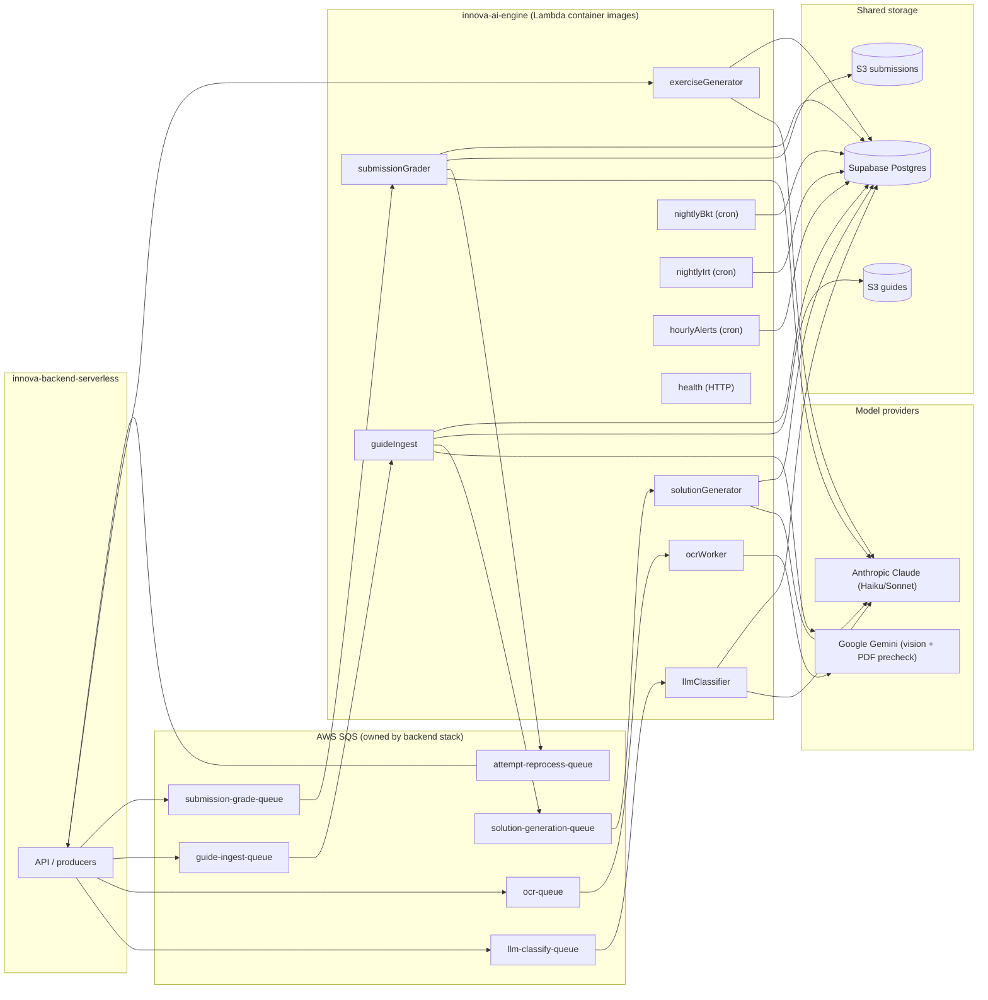

# innova-ai-engine

> Knowledge-tracing, error-classification and document-AI engine for the **SuperProfe / Innova** platform.
> Live in production at **https://ai.superprofes.app**.
>
> Python 3.11 (strict) · uv · Pydantic v2 · Anthropic Claude · Google Gemini · scipy · numpy · asyncpg · structlog
>
> **No PyTorch. No scikit-learn.** Deterministic math (BKT/IRT) on scipy/numpy; everything else via hosted LLMs.

---

## Table of contents

- [1. Overview](#1-overview)
- [2. Pipeline architecture](#2-pipeline-architecture)
- [3. Tech stack](#3-tech-stack)
- [4. Theoretical foundation](#4-theoretical-foundation)
- [5. Repository structure](#5-repository-structure)
- [6. Workers (Lambda functions)](#6-workers-lambda-functions)
- [7. Environment variables](#7-environment-variables)
- [8. Local setup](#8-local-setup)
- [9. Testing and coverage](#9-testing-and-coverage)
- [10. Production deployment](#10-production-deployment)
- [11. Cost control](#11-cost-control)
- [12. Methodology and workflow](#12-methodology-and-workflow)
- [13. License](#13-license)

---

## 1. Overview

This repository holds the **asynchronous AI workers** of SuperProfe. The `innova-backend-serverless` API
enqueues work to AWS SQS and shares S3 buckets and a Postgres database; this engine consumes those events,
calls the appropriate model, and writes results back to Postgres.

It does several families of work:

| Family | What it does |
|--------|--------------|
| Knowledge tracing | Nightly **BKT** parameter calibration and **IRT 2PL** item calibration |
| Error classification | Classifies `UNCLASSIFIED` attempts against a 2,600+ error taxonomy (Claude) |
| Document AI (guides) | PDF ingest, solution-key generation, handwritten-submission grading |
| Vision OCR | Reads handwritten student work (Gemini + Claude vision) |
| Exercise generation | Generates new exercises for a topic on demand (Claude) |
| Alerting & evaluation | Hourly at-risk detectors; offline grading-quality evaluation |

Each worker follows **Clean Architecture** (domain → ports → adapters → handler): pure domain logic, I/O
behind ports (Postgres, SQS, S3, Anthropic, Gemini), and a thin Lambda handler that wires them together.

---

## 2. Pipeline architecture



Guides flow (v9): `guideIngest` extracts questions from the PDF (Gemini precheck → Claude extract → figures
via pypdfium2) → publishes to `solution-generation` → `solutionGenerator` builds the step-by-step key and sets
the guide to `REVIEW` → after the student uploads photos, `submissionGrader` transcribes and grades them and
republishes to `attempt-reprocess` so the backend turns them into attempts.

---

## 3. Tech stack

| Concern | Choice |
|---------|--------|
| Language | Python 3.11, `from __future__ import annotations`, full type hints |
| Packaging | `uv` (`pyproject.toml`, `uv.lock`) |
| Config / schemas | Pydantic v2 + `pydantic-settings` |
| Math | scipy + numpy (BKT grid search, IRT 2PL MLE) |
| LLM | `anthropic` SDK (Claude Haiku / Sonnet), prompt caching, forced tool use |
| Vision / PDF | `google-genai` (Gemini 2.5 Flash), `pillow`, `pypdfium2` |
| DB | `asyncpg` (direct, no ORM, async pool) |
| AWS | `boto3` (SQS, S3, SSM) |
| Logging | `structlog` (JSON) with trace ids and cost/token accounting |
| Lint / types | `ruff`, `pyright` (strict mode, zero errors) |
| Tests | `pytest` (+ `pytest-asyncio`, `hypothesis`, `moto`) |
| Deploy | Serverless Framework + Lambda **container images** (`Dockerfile.lambda`) |

---

## 4. Theoretical foundation

**Bayesian Knowledge Tracing (BKT).** Corbett & Anderson (1995). Four parameters per topic
(`p_l0, p_transit, p_slip, p_guess`, with `p_slip + p_guess < 1`). The backend does the online update on each
attempt; this engine **recalibrates** the parameters nightly via brute-force grid search (step 0.05),
minimizing negative log-likelihood over attempt history, and writes them back to Postgres.

**Item Response Theory (2PL IRT).** Lord (1980). Each exercise has discrimination `a ∈ [0.5, 3.0]` and
difficulty `b ∈ [-3, 3]`, fit nightly with `scipy.optimize` (L-BFGS-B, MLE) once it has ≥50 attempts. The
backend then uses Fisher information `I(θ) = a²·P(θ)·(1−P(θ))` to pick the next item.

**LLM error classifier.** Attempts the rule engine can't handle are grouped by domain and classified by
Claude Haiku in batches of 20 against a proprietary taxonomy of 2,600+ procedural errors aligned to the
Chilean curriculum (17 domains). Prompts use ephemeral caching on the system block and forced `tool_use`;
results carry token/cost metadata. No PII is sent (only `attempt_id`, steps, topic).

**OCR vision.** Handwritten work is read with Gemini first (`GEMINI_MODEL`, default `gemini-2.5-flash`) and
escalated to Claude vision when confidence is below threshold. Output is structured LaTeX steps with a
confidence score.

---

## 5. Repository structure

```
innova-ai-engine/
├── src/
│   ├── bkt/                 # nightly BKT calibration (grid search) + reference online update
│   ├── irt/                 # nightly IRT 2PL calibration + Fisher information
│   ├── llm_classifier/      # UNCLASSIFIED attempts → Claude → ErrorTag (batch 20, cached, tool_use)
│   ├── ocr/                 # vision OCR via MathOCRPort (Gemini → Claude escalation)
│   ├── guide_ingest/        # A6: PDF → questions (Gemini precheck → Claude → figures via pypdfium2)
│   ├── solution_gen/        # A7: questions → step-by-step solution key
│   ├── submission_grader/   # A8: student photos → transcribe + grade → attempt-reprocess
│   ├── exercise_generator/  # generate new exercises for a topic
│   ├── adhoc_solver/        # A10: solve a scan with no guide context (code present, not wired)
│   ├── alerts/              # A9.2 hourly at-risk detectors
│   ├── grading_eval/        # A9.1 offline grading-quality scorer + CLI gate
│   ├── observability/       # structlog config, trace ids, cost/token accounting
│   ├── pipeline/            # Lambda handlers (one per worker) wiring domain + adapters
│   └── shared/              # ports, adapters (asyncpg/SQS/S3/Anthropic/Gemini), settings
├── tests/                   # pytest suites (unit + property + moto)
├── out/                     # generated error catalog (catalog/, error_catalog.jsonl)
├── Dockerfile.lambda        # Lambda container image (native deps: pypdfium2, pillow)
├── serverless.yml           # 10 functions (see §6)
├── pyproject.toml           # uv project + ruff + pyright + pytest config
└── README.md
```

Each worker package separates `domain.py` (pure logic), `ports.py`/protocols and adapters, with the
deployable handler under `src/pipeline/`. Internal imports always use the `src.` prefix.

---

## 6. Workers (Lambda functions)

`serverless.yml` defines ten functions:

| Function | Trigger | Purpose |
|----------|---------|---------|
| `health` | HTTP (`ai.superprofes.app/health`) | Liveness probe |
| `llmClassifier` | SQS `llm-classify-queue` (batch 20) | Classify unclassified attempts (Claude) |
| `ocrWorker` | SQS `ocr-queue` | OCR handwritten work (Gemini → Claude) → publish to `attempt-reprocess` |
| `guideIngest` | SQS `guide-ingest-queue` | Extract questions from a worksheet PDF |
| `solutionGenerator` | SQS `solution-generation-queue` | Build the step-by-step solution key |
| `submissionGrader` | SQS `submission-grade-queue` | Transcribe + grade student photos |
| `exerciseGenerator` | SQS / invoke | Generate new exercises for a topic |
| `nightlyBkt` | EventBridge `cron(0 7 * * ? *)` | Recalibrate BKT parameters |
| `nightlyIrt` | EventBridge `cron(15 7 * * ? *)` | Recalibrate IRT item parameters |
| `hourlyAlerts` | EventBridge `cron(0 * * * ? *)` | Detect at-risk students, raise alerts |

> `adhoc_solver` (A10) exists in code but is **not yet wired** as a function in `serverless.yml`; it is a
> follow-up if ad-hoc scan solving is needed in prod.

---

## 7. Environment variables

Template in `.env.example`. Loaded and validated via `pydantic-settings` (`src/shared/settings.py`).

| Variable | Description |
|----------|-------------|
| `ANTHROPIC_API_KEY` | Claude API key |
| `GEMINI_API_KEY` | Google AI Studio key |
| `GEMINI_MODEL` | Vision/PDF model (default `gemini-2.5-flash`; `gemini-2.0-flash` was retired 2026-06-01) |
| `DATABASE_URL` | Postgres. **Prod: Supabase session pooler `:5432`** (asyncpg breaks on the transaction pooler's prepared statements). Local: shared backend Postgres on `:5433`. |
| `MONGODB_URI` | Telemetry/audit Mongo (shared with backend) |
| `AWS_REGION` | `us-east-1` (handlers read it as `APP_AWS_REGION`, since `AWS_REGION` is reserved inside Lambda) |
| `SQS_LLM_CLASSIFY_ARN` / `SQS_OCR_QUEUE_ARN` | Triggers owned by the backend stack |
| `SQS_GUIDE_INGEST_ARN` / `SQS_SOLUTION_GEN_ARN` / `SQS_SUBMISSION_GRADE_ARN` | v9 pipeline triggers |
| `SQS_SOLUTION_GEN_URL` / `SQS_ATTEMPT_REPROCESS_URL` / `SQS_ADHOC_SOLVE_URL` | Queues this engine publishes to |
| `S3_GUIDES_BUCKET` / `S3_SUBMISSIONS_BUCKET` | Shared S3 buckets |
| `SSM_GUIDES_*_PAUSED_PARAM` | SSM kill-switch params (ingest / solution / grading) |
| `GUIDE_INGEST_CHUNK_PAGES` / `_OVERLAP` / `GUIDE_MIN_EXTRACTION_QUALITY` | Ingest tuning |
| `SOLUTION_GEN_USE_BATCHES` / `SOLUTION_TOPIC_MIN_CONFIDENCE` | Solution-gen tuning |
| `GRADING_MIN_TRANSCRIPTION_CONFIDENCE` / `SSM_GUIDES_CHEAP_MODE_PARAM` | Grading tuning |
| `ALERT_AT_RISK_PKNOWN_FLOOR` / `ALERT_AT_RISK_MIN_TOPICS` / `ALERT_TOPIC_STRUGGLE_RATIO` | Alert thresholds |

> The SQS ARNs/URLs and S3 buckets are **created by the backend Serverless stack**, which is why the deploy
> order is **backend → ai-engine**.

---

## 8. Local setup

### Prerequisites

- Python 3.11 (pinned in `.python-version`)
- [`uv`](https://docs.astral.sh/uv/) (`curl -LsSf https://astral.sh/uv/install.sh | sh`)
- Docker (to run the backend's `docker-compose` for shared Postgres/Mongo/LocalStack)
- Anthropic and Gemini API keys (only for features that call them)

### Steps

```bash
# 1. Install deps + dev tools (creates .venv automatically)
uv sync --all-extras

# 2. Environment
cp .env.example .env
# edit .env: ANTHROPIC_API_KEY, GEMINI_API_KEY, DATABASE_URL, MONGODB_URI

# 3. Start shared infra from the backend repo (Postgres/Mongo/LocalStack)
#    (in ../innova-backend-serverless: docker compose up -d)

# 4. Lint + type check
uv run ruff check src tests
uv run pyright

# 5. Tests (no smoke — no API keys needed)
uv run pytest
```

### Run a worker locally

Workers are Lambda handlers; invoke them with a simulated event. For example, the nightly BKT job:

```bash
uv run python -c "from src.pipeline.nightly_bkt import handler; handler({}, None)"
```

SQS/S3 workers can be exercised against LocalStack and `moto` fixtures (see `tests/`).

### Curriculum loader

`scripts/curriculum_loader.py` parses the curriculum text files (`../*.txt`) into structured JSON that the
backend's Prisma seeds consume.

---

## 9. Testing and coverage

```bash
uv run pytest                    # full suite (excludes smoke)
uv run pytest --cov=src          # with coverage (gate ≥75%)
uv run pytest -m smoke           # real API calls — main-branch CI only
uv run ruff check src tests      # lint
uv run pyright                   # strict type check (0 errors required)
```

Tests cover BKT/IRT math (property + recovery tests with `hypothesis`), the LLM classifier and graders (mocked
providers; assert `cache_control` and forced `tool_choice`), SQS/S3 flows (`moto`), and the guide pipeline end
to end. The `smoke` marker gates tests that make real provider calls; they run only on `main`.

---

## 10. Production deployment

Production runs on **AWS account `751871643325`, region `us-east-1`**. The authoritative runbook is
`../docs/DEPLOY_RUNBOOK.md`.

### Mechanism

- Each worker ships as a **Lambda container image** built from `Dockerfile.lambda`. Native deps (`pypdfium2`,
  `pillow`) must be installed in the image, not only declared in `pyproject.toml`.
- `serverless.yml` maps the ten functions to their SQS / cron / HTTP triggers using the ARNs **exported by the
  backend stack**. Deploy order is **backend → ai-engine**.
- CI/CD: `.github/workflows/ci.yml` (ruff + pyright + pytest) on PRs; `.github/workflows/deploy.yml` builds
  and pushes the images and deploys on merge to `main`.

### Required secrets (GitHub Actions)

`AWS_ACCESS_KEY_ID/SECRET_ACCESS_KEY/REGION`, `AWS_ACCOUNT_ID`, `ANTHROPIC_API_KEY`, `GEMINI_API_KEY`,
`DATABASE_URL` (Supabase **session pooler `:5432`**), `MONGODB_URI`, and the SQS ARNs/URLs + S3 buckets that
point at the backend stack resources (`SQS_GUIDE_INGEST_ARN`, `SQS_SOLUTION_GEN_ARN/URL`,
`SQS_SUBMISSION_GRADE_ARN`, `SQS_ATTEMPT_REPROCESS_URL`, `S3_GUIDES_BUCKET`, `S3_SUBMISSIONS_BUCKET`,
`SQS_LLM_CLASSIFY_ARN`, `SQS_OCR_QUEUE_ARN`).

### Verify

```bash
curl -s https://ai.superprofes.app/health     # 200 OK
```

### Error catalog

The proprietary error taxonomy is generated under `out/catalog/` (and `out/error_catalog.jsonl`). The backend
imports it into the `ErrorTag` table (`pnpm import:catalog`) and regenerates the rule-engine enums
(`pnpm codegen:error-tags`); activating or deprecating tags requires re-import + re-codegen + redeploy.

---

## 11. Cost control

Inference is the dominant cost, so every provider call records token usage and cost (`src/observability`).
SSM kill-switch parameters (`/innova/llm/paused`, `/innova/ocr/paused`, `SSM_GUIDES_*_PAUSED_PARAM`) let prod
pause a stage without a redeploy; workers check them before calling a model and drop to the DLQ with
`paused_due_to_cost` metadata. Terminal classification/grading failures fail fast (no infinite retries) and a
"cheap mode" SSM flag downgrades grading under cost pressure.

---

## 12. Methodology and workflow

GSD/BMAD with declared AI-agent usage; living docs in `../docs/`. Gitflow with `develop` as the integration
branch and a protected `main` (PR + green CI). Conventional Commits in English. Mandatory gates before merge:
`ruff` (0 issues), `pyright` strict (0 errors), `pytest` (coverage ≥75%).

---

## 13. License

Innova — Team 23. Internal GPL-3.0 license.
