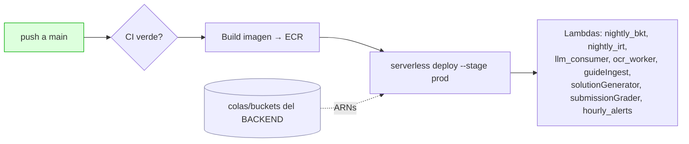

# Deploy & CI/CD — innova-ai-engine (AWS Lambda contenedores · Python 3.11)

> Workers ML/AI (BKT, IRT, LLM classifier, OCR, hourly alerts, pipeline de guías) como
> **Lambda contenedores ECR** vía Serverless v3. **Event-driven** (SQS / S3 / EventBridge),
> no es una API pública. Dominio reservado: `ai.superprofes.app`. Última revisión: 2026-06-14.

---

## 1. Arquitectura de deploy



> ⚠️ **Dependencia de orden:** las colas/buckets que estos workers consumen las **crea el stack
> `innova-backend-serverless`**. **Deploya backend PRIMERO**, copia los ARNs y recién deploya aquí.

---

## 2. Política de ramas

- CI (`ci.yml`) corre en `main`, `feature/**`, `bugfix/**` y PRs.
- **Deploy SOLO en `main`** (`deploy.yml`). ✅ correcto.

---

## 3. ⚠️ Pre-requisito que HOY bloquea CI

El CI falla en `ruff` por un **f-string multilínea inválido en Python 3.11**
(`src/llm_classifier/client.py`). **El fix ya está en tu working tree pero SIN commitear**
(el último commit del archivo aún tiene el bug). Antes de cualquier deploy:

```bash
uv run ruff check src/ tests/ && uv run ruff format --check src/ tests/ && uv run pyright src/
git add -A && git commit -m "fix(llm_classifier): py3.11-safe f-string + A9 pipeline" && git push
```

---

## 4. Secrets de GitHub Actions

📍 `https://github.com/vruizz22/innova-ai-engine/settings/secrets/actions`

### 4.1 AWS + IA + DB (ya los tienes)

| Secret | Qué es | Dónde |
|---|---|---|
| `AWS_ACCESS_KEY_ID` / `AWS_SECRET_ACCESS_KEY` | IAM deploy user (Lambda, ECR, CloudFormation, SQS, S3, SSM) | AWS → IAM → Access keys |
| `AWS_REGION` | Región | `us-east-1` |
| `AWS_ACCOUNT_ID` | ID de cuenta (para ECR) | AWS Console arriba a la derecha, o `aws sts get-caller-identity` |
| `ANTHROPIC_API_KEY` | console.anthropic.com | — |
| `GEMINI_API_KEY` | aistudio.google.com | — |
| `DATABASE_URL` | Postgres Supabase (mismo que backend) | Supabase → Settings → Database |
| `MONGODB_URI` | MongoDB Atlas | cloud.mongodb.com |
| `SQS_LLM_CLASSIFY_ARN` | ARN cola llm-classify | del stack backend |
| `SQS_OCR_QUEUE_ARN` | ARN cola ocr | del stack backend |

### 4.2 ⚠️ FALTAN — del pipeline de guías v9 (A6/A7/A8)

Sin estos, `serverless deploy` muere con
*"Cannot resolve variable ... functions.guideIngest.events.0.sqs.arn"*.
**Salen de los outputs del stack `innova-backend-serverless`** (corre allí
`serverless info --verbose --stage prod` o míralos en AWS Console → SQS).

| Secret | Qué es | Cómo obtenerlo |
|---|---|---|
| `SQS_GUIDE_INGEST_ARN` | ARN cola guide-ingest | output del backend / SQS console |
| `SQS_SOLUTION_GEN_ARN` | ARN cola solution-gen | idem |
| `SQS_SUBMISSION_GRADE_ARN` | ARN cola submission-grade | idem |
| `SQS_SOLUTION_GEN_URL` | URL (no ARN) de solution-gen | SQS console → Queue URL |
| `SQS_ATTEMPT_REPROCESS_URL` | URL cola attempt-reprocess | idem |
| `S3_GUIDES_BUCKET` | `innova-backend-serverless-prod-guides` | nombre del bucket del backend |
| `S3_SUBMISSIONS_BUCKET` | `innova-submissions-prod` | idem |

> Los 3 `*_ARN` son **obligatorios** (event source SQS, sin default). Las URLs/buckets tienen
> default `''` en `serverless.yml` pero el pipeline de guías no funciona en runtime sin ellos.

### 4.3 Opcionales (tienen default en `serverless.yml`)

`OCR_CONFIDENCE_THRESHOLD` (0.7), `LLM_BATCH_SIZE` (20), `SSM_*_PARAM`, `APP_AWS_REGION`
(us-east-1; **nunca uses `AWS_REGION` como env de la Lambda — es reservado**), `LOG_LEVEL`.

---

## 5. Deploy y verificación

```bash
# 0) backend ya deployado y ARNs cargados como secrets (§4.2)
# 1) fix de CI commiteado (§3)
git push origin main                  # dispara deploy.yml
# o Actions → Deploy Lambdas → Run workflow
```

### Verificación (es event-driven, no hay endpoint que abrir)

- Actions verde: `https://github.com/vruizz22/innova-ai-engine/actions/workflows/deploy.yml`
- `pnpm`/`serverless info --stage prod`: las 8 funciones aparecen con sus triggers.
- AWS Console → **Lambda**: cada función existe, runtime *Image*, sin errores de config.
- AWS Console → **SQS** → cada cola → pestaña *Lambda triggers*: el consumer está conectado.
- **CloudWatch Logs**: envía un mensaje de prueba a una cola y confirma que el worker logea
  `structlog` JSON sin excepción de import/env.
- EventBridge: las crons (`nightly_bkt` 07:00, `nightly_irt` 07:15, `hourly_alerts` 0 ** *) existen.

---

## 6. Troubleshooting (fallos reales ya vistos)

| Síntoma | Causa | Fix |
|---|---|---|
| CI `test` rojo en ~12s, `invalid-syntax` f-string | bug Py3.11 sin commitear | §3 commitear el fix |
| Deploy: `Cannot resolve ...sqs.arn ... Value not found at "env"` | faltan `SQS_*_ARN` | §4.2 |
| `AWS_REGION is reserved` en Lambda | usar env reservada | usar `APP_AWS_REGION` |
| ECR push denegado | IAM sin permisos ECR / `AWS_ACCOUNT_ID` | revisar IAM + secret |
| Warning Node 20 deprecated | actions viejas | Ya bumpeadas (checkout@v5, setup-python@v6, configure-aws-credentials@v5) |
